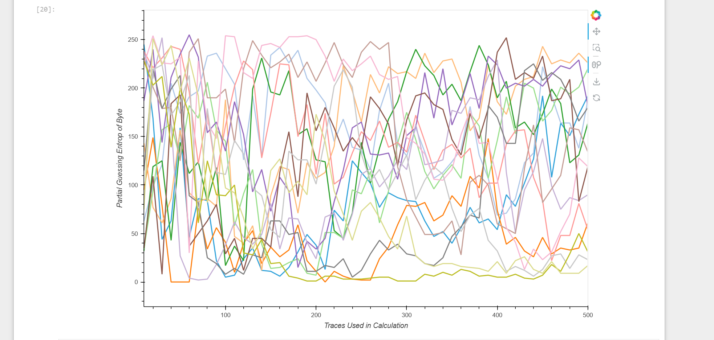
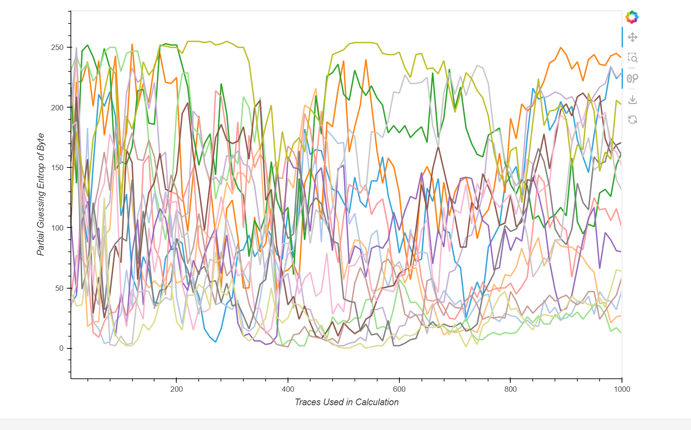
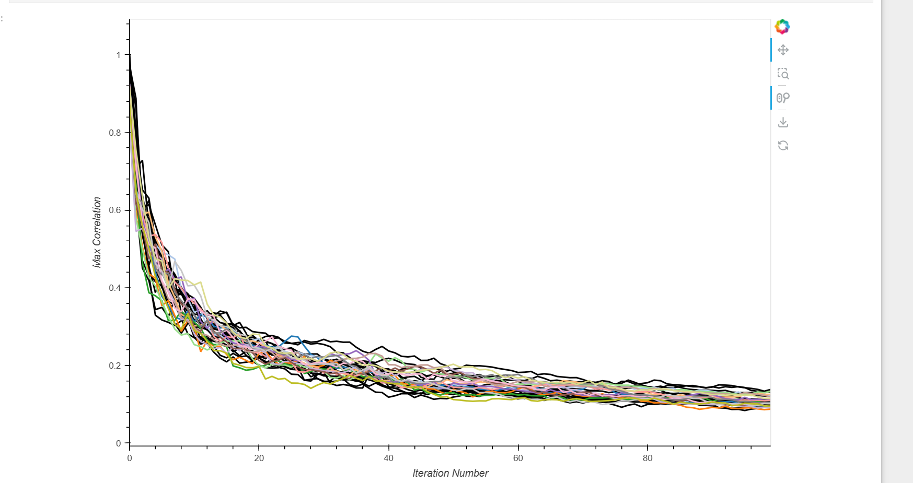

# Summer Research 2026
## What is Hardware Security  

- Hardware security focuses on protecting physical computing components such as integrated circuits (ICs), processors, and embedded systems from attackers and tampering. 

- We heavily relie on 3rd party resources which can create security risks. This weakens assumptions that attackers cannot access the isolated IC supply chain. For example, 3rd partie resources may insert hardware trojans into chips  
- Hardware Security is basically that we want to make it harder for attackers to hurt our hardware 
#### What do these attackers target? 
 - cryptographic functions 
 - secure architectures 
 - IP (intellectual property) 
 - Machine learning models 
### Sources: 
https://www.mdpi.com/2079-9292/4/4/763 
https://ieeexplore.ieee.org/abstract/document/9310331 
# Hardware Security Goals 
### Secure hardware design has two main Goals: 
- Maintain required performance safely 
- Protect against seasoned attackers who may interfer with the system 

# Integrated Circuits (ICs) and Supply Chain Risks 
- Modern ICs include CPUs, memory, and third-party IP cores. 

-  Due to worldwide manufacturing, they are more vulnerable to attacks. 

### IC Lifecycle Risks 
#### Design stage   
-Relies on trusted CAD tools 
#### Fabrication stage  
- High risk of Trojan insertion 
#### Manufacturing stage  
- Trust depends on testing environment 
### Sources: 
https://ieeexplore.ieee.org/abstract/document/10159361 

# Hardware Trojans 

- A malicious addition to an IC designed to compromise security or leak data. 

#### Where can Hardware Trojans exist? 

- ASICs 
- Microcontrollers 
- 3rd party components 
- Which are usually hidden and triggered under specific conditions 
### Sources: 

https://ieeexplore.ieee.org/abstract/document/5406669 

# Side-Channel Attacks 
### EM side-channels
- Unintentional electromagnetic are for general embedded systems purposes that have been studied to be data recovery and monitoring tools for hardware security. 

- EM side channels have been demonstrated on embedded cryptosystems and microprocessors but there is not much work covering the effectiveness in surveilling wireless communication between connected devices (blue tooth).  

### Timing side-channels
 - Timing side channels can show information about hidden code locations in memory.
- Even little timing differences can help attackers bypass defenses such as Address Space Layout Randomization (ASLR).

- Timing side channels can identify functions, gadgets, and even system call locations inside randomized code.

- Fine grained ASLR gave the strongest defense but was still vulnerable to side-channel leakage.

- Timing attacks remained possible over noisy network environments.

### Sources: 
https://dl.acm.org/doi/10.1145/3649476.3658742 
https://dl.acm.org/doi/abs/10.1145/2660267.2660309

# "FPGA oriented moving target defense against threats from malicious FPGA tools"

### FPGA security 4 main aspects
- secure operations implemented by FPGA devices
- Utilization of FPGAs for system security enhancement
- Secure bitstream delivery to FPGA devices 
- Exploitation of FPGA devices as a attack surface of FPGA based systems 

there is Limited work covering security threats from malicious FPGA design software

At end of introduction in the research paper they explain how they test this. 

### source
https://ieeexplore-ieee-org.ezproxy.lib.ucalgary.ca/document/8383907 

# Hardware noise vs Software noise
 ### Hardware Noise
 - noise created by the PCB and peripherals. (capacitors, resistors, power regulators)
 - Electromagnetic interference from close components on the board
 - Temperature changes affecting resistance and the signal behavior

### Software Noise
- system-level interferences such as other processes, interrupts, and system calls
- Can be reduced with disabling interrupts during the measurement and fixing clock speed

### source
https://arxiv.org/pdf/2410.11563

# categories of hardware security
- Physical security (the hardware itself) 
- Software attacks on hardware 
- Classic hardware attacks (trojans) 
- Cryptographic hardware  

# CPA Side-Channel Attacks - steps
### 1) collect the power traces
- run AES device multiple times
- for each encryption you must record the plaintext and the power consumption over time
- each trace contains thousands of sample points
### 2) guess a key byte
- choose 1 byte of the key to target at a time
- for the chosen byte there will be 256 possible values(create a list of all the 256)
### 3) compute the s-box output
- for every plaintext and every guess (s-box)
- that  gives predicted intermediate values for each plaintext, key guess pair
### 4) compute hyp power
- most CPA attacks assume the device will leak Hamming weight 
- for each of the hypothetical s-box outputs you want to count the number of 1 bits this will now become the hypothetical power consumption for that guess
### 5) now compare with the real power traces
- use pearson correlation to compare the values from step 4 against the real recorded power traces (step 1)
- do for every point

### 6) repeat this for every key guess and every time sample
- if the graph is wrong you get 0 or near 0.
- if correct then a spike occurs when a s-box computation happens
### 7) pick best key
- this is the largest correlation peak

# DPA Side-Channel attack - steps
### 1)  collect power traces
- run target algorithm many times with known data inputs (plaintext)
- use oscilloscope to meaure power consumption to store captured waveforms as a dataset of power traces

### 2) determine intermediate value
- S-box or AES sub box
- targets a single bit of the intermediate value
### 3) guess subkey and predict the target bit
- make a list for all possible values (256 guesses for 8 bit key)
- for each guess combine it with known plaintext to compute the intermediate value, then we will guess if the target is 0 or 1
### 4) separate traces into 2 groups
- from step 3 we separate all traces into 2 groups. guessed bit = 0 and guessed bit = 1
- no hamming weight or distance needed that is only for CPA
### 5) calculate difference of means
- take average of all traces in the 2 groups so avg of group 0 and avg group 1
- subtract the average traces from the other to get a single trace
### 6) look for the spike
- if subkey guess is right the trace shows clear spike at the time sampled where the bit is process
- if incorrect the split is random so the trace stays flat
### 7) repeat for all sub key guesses
- the highest peak is the correct key byte
- do this for all to get the full key

# problems with DPA attacks attackers face
- high sensitivity to noise (power supply noise, measurement noise, and environment can block the signal)
- to break things like AES it needs thousands or more (typically) captured power traces to successfully recover a key
- power traces should be properly aligned in time so the corresponding operations occur at a consistent sample points, bad alignment reduces correlation and can degrade attack success

### sources
- https://yan1x0s.medium.com/side-channel-attacks-part-2-dpa-cpa-applied-on-aes-attack-66baa356f03f
- https://keccak.team/files/NoteSideChannelAttacks.pdf

# problem with DPA attacks security issues
- creates issues for smart cards and microcontrollers
- attackers are able to get sensitive data without leaving digital or physical damage behind
- these attacks can be used with available hardware such as oscilloscopes which means pretty low costs compared to other attacks out there.

### sources
- https://www.rambus.com/understanding-differential-power-analysis/

# Ghost peaks
- many key hypotheses producing similar correlation
- ghost peaks are where many incorrect key guesses produce similar scores making it difficult to clearly identify correct key they occur due to noise or imperfect leakage models which can create ghost peaks

### sources
- https://link.springer.com/chapter/10.1007/978-3-642-19574-7_17

# Difference between TinyAES128C and MBEDTLS
- TINYAES128C - single purpose aes implementation. Just a AES block cipher and nothing else, it is very small (couple hundred KB source wise, tine compiled foot print), there is no hashing no RSA no TLS no key exchange just the aes 
- MBEDTLS - bigger, it has AES plus full tls 1.2/1.3 stack, ECC, SHA, RSA, HMAC, X.509 certificates, random number generation, key exchange protocals. 
- Main difference is TINYAES128C is ultralight weight, 8 bit implementation designed for minimzing code size, the MBEDTLS uses 32-bit lookup tables which is optimized for speed and production security 

### sources
- https://github.com/kokke/tiny-AES-C 

# Testing different aes
### TINYAES128C
- Starting at 50 traces - 0.90 correlation number (higher cleaner signal easier to hack), (40 traces) correct key - at 40 traces or lower all 16 bytes are clear 

### MBEDTLS
- MBEDTLS - at 50 traces 0.87 correlation number (lower noiser harder to hack), (40 traces) didnt full recover the key, needs 50 or higher to resolve the key meaning more side channel resilient 

### masked-aes-c
- The masked-aes-c implementation hides the real AES data and key by combining them with random values (masking) at every step, so the actual secret values are never directly processed by the chip.
- tried 100 traces key was not guessed
- then tried 500 traces we can see that it is not really settling down but it is getting closer
- 
- 1000 traces - key still not recovered at 1000 traces, masked aes is considered the strongest and is also the most studied side channel resilient aes
- 
- 
- Lastly, I tried 5000 traces. many of the PGE lines started trending toward 0, showing the attack is beginning to make progress, but none had fully reached 0 yet. This may show masked-aes-c is a strong implementation against a basic CPA attack. 

#### overall review on masked-aes-c
- Masking is usually considered a strong side-channel countermeasure because it removes correlation between the secret value and the physical computation at the data level. 

https://github.com/CENSUS/masked-aes-c/tree/main

###  AES Implementation wrote in C with MASK countermeasure
- 

https://github.com/jcalabres/AES-C
### 

### AI created implementation
- 

### did not work with Chipwhisper nano
#### MASKEDAES 
- did not work because it requires a Cortex-M3/M4 architecture, a  architecture limitation for masked AES on Nano's Cortex-M0.

#### AESSIMPLE
- Attempted to build this target, but found that the required source folder (crypto/straightforward-aes/) does not exist in the ChipWhisperer firmware repository, despite Makefile.straightforward-aes and the AESSIMPLE Makefile.crypto entry referencing it. This implementation could not be tested as a result.
